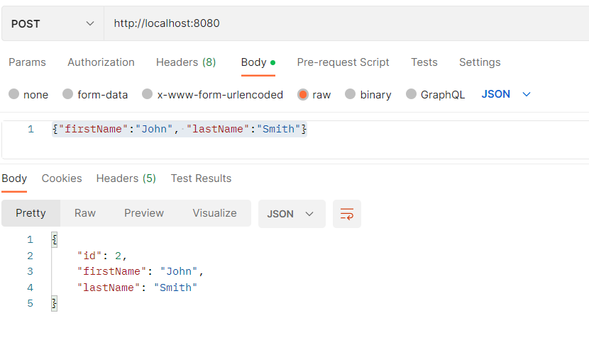

# REST-API-JPA
Demonstrate REST API and JPA features in JAVA + SprintBoot
 
Start: mvn spring-boot:run

Add a customer: 
Post http://localhost:8080
{"firstName":"John", "lastName":"Smith"}

List a customer:
Get http://localhost:8080/1

Update a customer:
Put http://localhost:8080/1
{"firstName":"Jerry", "lastName":"Smith"}

List all customers:
Get http://localhost:8080

